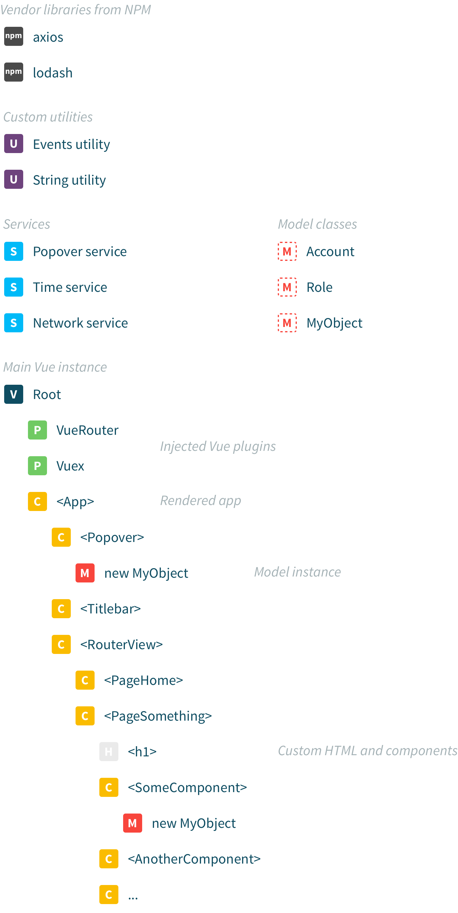

# Project structure



## Source code

[Browse source on GitHub](https://github.com/Eiskis/vue-webpack)

```
docs/                                // Documentation generated from codebase
src/
	|_ app-icon/                     // App icon assets
	|_ assets/                       // Generic asset files such as images
	|_ components/                   // Views, single-file .vue components
	|_ config/                       // Custom pipeline and client-side configuration
		|_ config-aliases.js
		|_ config-base.js
		|_ config-routes.js
	|_ fonts/                        // Web font assets
	|_ models/                       // JS business logic objects
	|_ services/                     // JS custom (reactive) services
	|_ store/                        // JS state management code
	|_ styles/                       // Global base styling and style utilities
		|_ base/
		|_ definitions/
		|_ keyframes/
		|_ mixins/
		|_ normalize/
		|_ plugin-overrides/
		|_ toolchain/
		|_ transitions/
		|_ utilities-base/
		|_ utilities-composed/
		|_ webfonts/
		|_ global.scss               // All global base styling
		|_ shared.scss               // All SCSS constants and mixins
		|_ utilities.scss            // All global CSS utilities
	|_ svg/                          // SVG assets that will be compiled into a sprite
	|_ util/                         // JS custom misc. utilities
	|_ vue/
		|_ directives/               // Vue directives
		|_ mixins/                   // Vue mixins
		|_ plugins/                  // Vue plugins
	|_ index.html.ejs                // Main HTML template
	|_ main.js                       // Vue setup and main entry point for client app
	|_ stylelint.config.js           // Linter configuration
	|_ .htmllintrc                   // Linter configuration
	|_ .eslintrc.js                  // Linter configuration
static/                              // Static files to host alongside product
test/
	|_ e2e/                          // End-to-end tests on Nightwatch
		|_ custom-assertions/
		|_ specs/
	|_ unit/                         // Unit tests on Karma and Mocha
		|_ specs/
			|_ components/
			|_ models/
			|_ store/
```


## Tooling

```
build/             // Webpack build scripts
config/            // Webpack environment configuration
package.json       // Dev and app dependencies, development scripts
.nvmrc             // Node.js version
```

## Extras

```
.vscode/           // Workspace settings for Visual Studio Code
```
