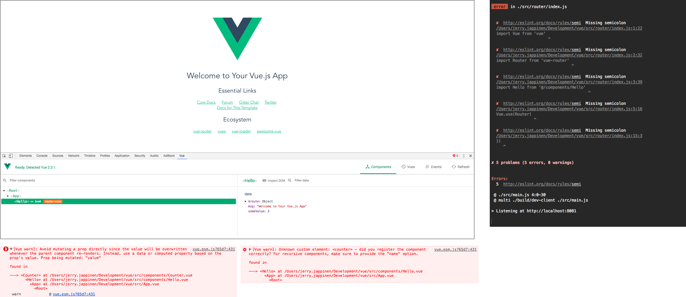

# Development builds

The following development tools have been configured for development aids:

- EditorConfig
- eslint: JS linting
- htmllint: HTML linting
- stylelint: SCSS linting

## Debugging

- [Vue.js devtools](https://chrome.google.com/webstore/detail/vuejs-devtools/nhdogjmejiglipccpnnnanhbledajbpd?hl=en): Chrome extension for Vue development
- You will see errors and linting issues
	- In the CLI
	- Overlayed in the browser when hot reloading
	- In browser's console.
- Any issues detected by the development version of Vue will be reported with detailed messaging in the browser's console.
- Client-side issues will be reported by the browser's console as expected.

During development, webpack will automatically recompile any of the assets needed and only the components that have changed will be rerendered in the browser. This is called "hot reload" or "module hot swapping". Browser extensions or other setup is required for this.
