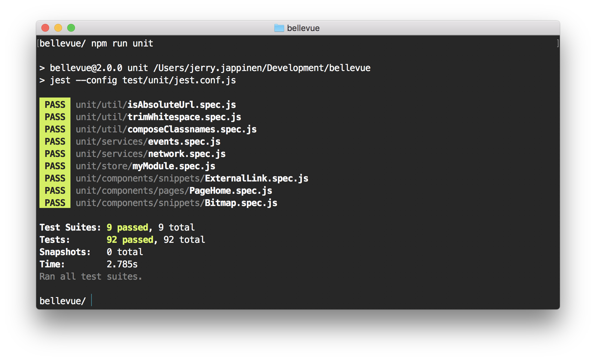
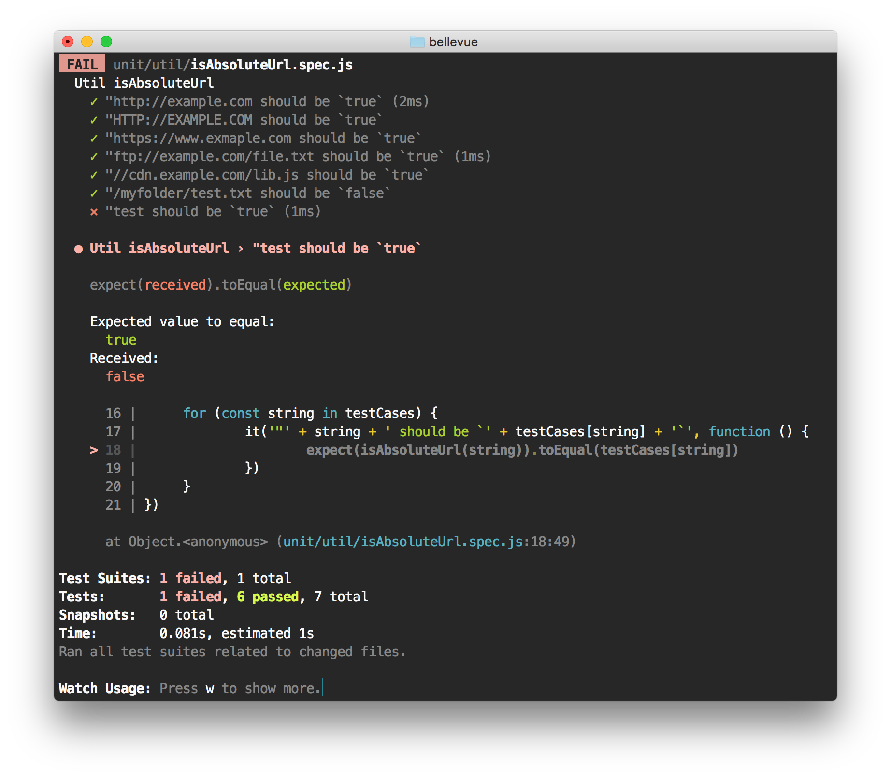
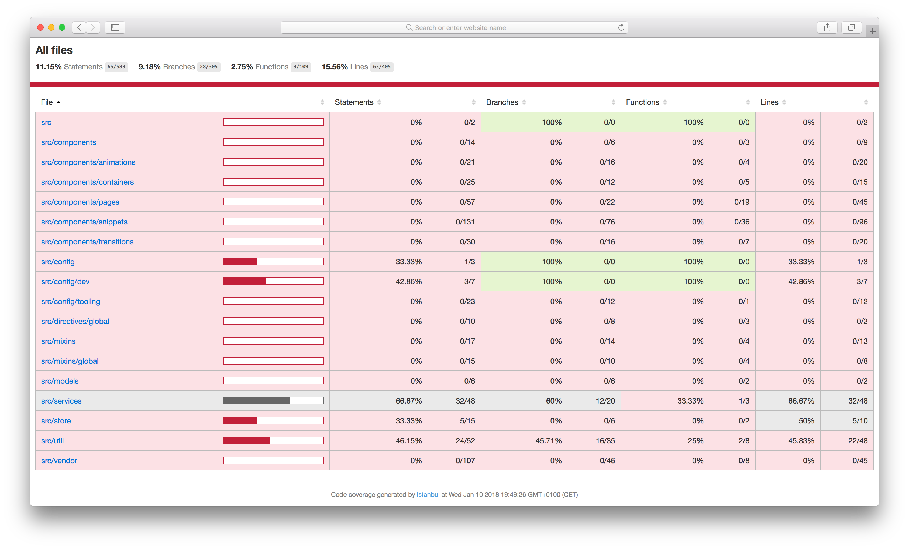

# Unit tests

```
unit/                 // Spec files
	├── components/
	├── models/
	├── services/
	├── store/
	└── util/
		└── myUtilName.spec.js
test/                 // Jest configuration
	└── unit/
		└── coverage/
		└── stubs/
```

Unit tests run on [Jest](https://facebook.github.io/jest/). Unit tests can be written for all the elements of application code, meaning services, models, components and utilities as well as Vuex code.

Run the tests with the scripts listed in [setup instructions](../overview/setup.md). Running unit tests on the command line gives you a report like this:

<!--  -->



The test pipeline will also generate an HTML report about the coverage, which looks like this:



The HTML report will be available under `/reports/lcov-report/`. You can open it over `file://`, no file server is needed.
