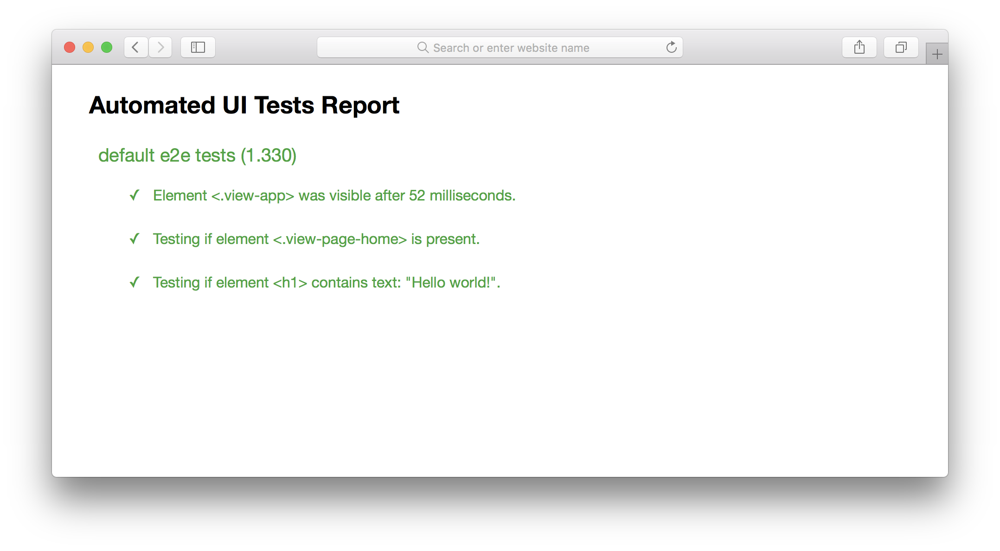

# End-to-end tests

```
reports/
	├── e2e/
	└── e2e.html
spec/
	└── e2e/
tooling/
	└── e2e/
		└── custom-assertions/
```

End-to-end tests are written using [Nightwatch.js](http://nightwatchjs.org/). By default they are run on Chrome, which has a [standalone driver](https://sites.google.com/a/chromium.org/chromedriver/) that doesn't have dependencies.

You can use the scripts listed in [setup instructions](../overview/setup.md) to run tests.

When running the tests, you will see test report in your CLI that looks like this:


The test pipeline will also generate an HTML report, which looks like this:



The HTML report will be available as `/reports/e2e.html`. You can open it over `file://`, no file server is needed.

### Selenium

Selenium is also supported, as it supports more browsers, but to use the Selenium driver you must have `Java SE Development Kit` installed. You can download the latest JDK for your platform on [Oracle's download page](http://www.oracle.com/technetwork/java/javase/downloads/jdk8-downloads-2133151.html).

After installing JDK successfully, you can set `DRIVER=selenium` when running the `e2e` script, and the tests will be run on Selenium instead of standalone Chrome.
