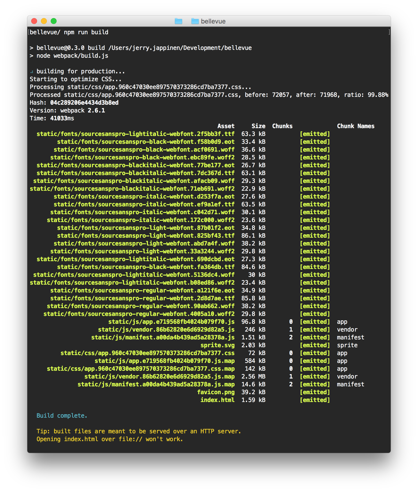
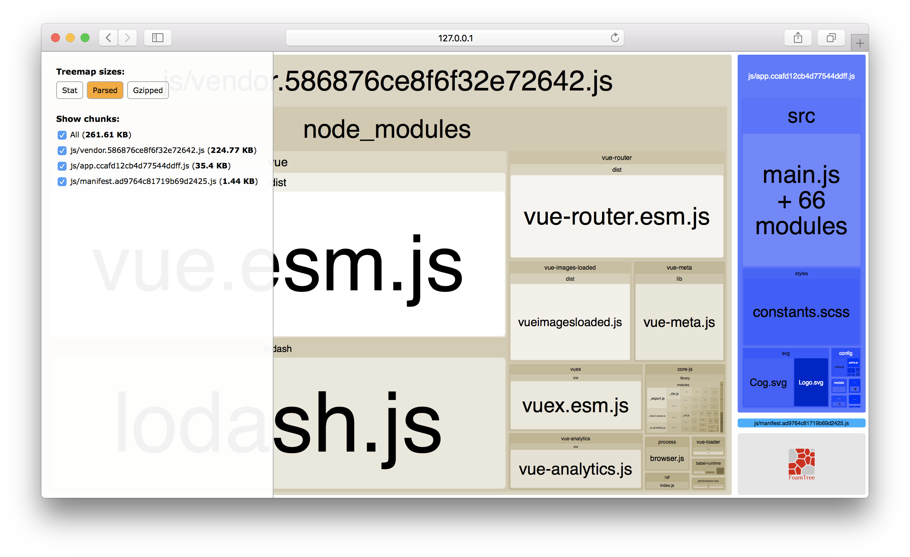

# Production builds

In production builds, the Webpack pipeline will do a lot of things to bundle all the requires code and assets as efficiently as possible for production environments. Among other things,

- HTML will be minified, and comments will be removed.
- CSS will be minified, and comments will be removed.
- JS will be minified and uglified, and comments will be removed.
- All static assets will be copied ofer to a the assets directory, and all related URLs resolved.
- Source maps will be generated for debugging production.

The resulting package is simply a collection of static files, that you can serve with any serve (Node, Apache, Nginx or etc.).

## Running the build scripts

To compile a bundle for production, simply use the following command:

```sh
npm run build
```

Once the build is complete, you will see a satisfying report in your terminal:



You can also `npm run build:report` to open a more detailed, inspectable graph in your browser:



This is a great way to get a better understanding of which libraries take up the lions' share of the bundle size, and where to optimize if your production builds are too big. This will also reveal any unintendedly included libraries.
